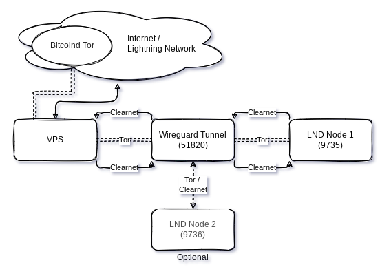

# Dual-LND-Wireguard-VPS
_Connect your lightning network nodes via wireguard VPN Tunnel through your VPS to allow fast and anonymous payments. When finished, you'll be able to run one or more of your Lightning Nodes via Tor and obfuscate your Clearnet IP Adress via a paid VPS_


This is a fork of my own Guide [provided here](https://github.com/TrezorHannes/Dual-LND-Hybrid-VPS), but instead of OpenVPN, we're using the somewhat smaller / simpler WireGuard Solution.
The Problem statement remains the same, you may prefer one solution over the other. Have a read through both and see what fits better. But in either case, you're coming here for the following reasons:
- have a dynamic IP from your Internet Service Provider
- want to hide your home IP from the world, for whatever reason
- prefer to have your node's traffic completely hidden from your ISP
- desire to decrease your Lightning Node HTLC routing times, so instead of running Tor only, you want Clearnet availability, too
-   run more than one Lightning Node, and want both to leverage the same VPN tunnel
- are just curious and want to tinker around a bit, because it's good to have those skills when demand for experience continues to rise


## Table of Content

- [Pre-Amble](#pre-amble)
  - [Objective](#objective)
  - [Challenge](#challenge)
  - [Proposed Solution](#proposed-solution)
- [Pre-Reads](#pre-reads)
- [Pre-Requisites](#pre-requisites)
- [Preperations](#preperations)
  - [Make notes](#make-notes)
  - [Visualize](#visualize)
  - [Secure](#secure)
- [Let's get started (LFG!)](#lets-get-started-lfg)
  - [Lightning Node](#lightning-node)
  - [VPS: Setup](#vps-setup)
  - [VPS: Connect to your VPS and tighten it up](#vps-connect-to-your-vps-and-tighten-it-up)
  - [VPS: Install Wireguard](#vps-install-wireguard)
    - [VPS: Firewall](#vps-firewall)
    - [VPS: LND Port-Forwarding](#vps-lnd-port-forwarding)
    - [VPS: Start your WireGuard Server](#vps-start-your-wireguard-server)
- [Into the Tunnel](#into-the-tunnel)
  - [LND Node: Install and test the VPN Tunnel](#lnd-node-install-and-test-the-vpn-tunnel)
  - [LND Node: LND adjustments to listen and channel via VPS VPN Tunnel](#lnd-node-lnd-adjustments-to-listen-and-channel-via-vps-vpn-tunnel)
- [Appendix & FAQ](#appendix--faq)


## Pre-Amble


### Objective
Your own, non-custodial [Lightning-Network](https://github.com/lightningnetwork/lnd) Node(s) running on both Tor and Clearnet [(Hybrid-Mode)](https://github.com/blckbx/lnd-hybrid-mode) installed on a cheap, but anonymous [Virtual Private Server (VPS)](https://www.webcentral.com.au/blog/what-does-vps-stand-for). This guide will outline the scenario for **two nodes**, so in case you only have one, or more than two, adjust the appropriate steps below.

### Challenge
We want payment options with ₿itcoin to be fast, reliable, non-custodial - but the service should ideally not be easily to be identifiable. We also see a lot of reliance on Tor to provide that, which sometimes comes with trade-offs in speed and reliability.

### Proposed Solution
There are plenty of ways how to solve for this. This creates hesitance to implement, especially when you're not very technical. This guide is supposed to provide _one approach_, whilst there remain many other ways to Rome. 
Take your time following this through. It might take you 1hr, depending highly on your skill. So don't go in here in a rush.

## Pre-Reads
This guide heavily relies on the intelligence and documentation of others 🙏, but putting those together to one picture creates the last 10% hurdle which is sometimes the highest. Have a careful read through the following articles, to get a deeper understanding on some of the lighter references we'll be using further below
- [Hybrid-Mode for LND](https://github.com/blckbx/lnd-hybrid-mode)
- [Expose server behind NAT with WireGuard and a VPS](https://golb.hplar.ch/2019/01/expose-server-vpn.html)
- [How To Set Up WireGuard on Ubuntu 22.04](https://www.digitalocean.com/community/tutorials/how-to-set-up-wireguard-on-ubuntu-22-04)


## Pre-Requisites
- running `lnd-0.14.2-beta` or later. This can either be a pre or post 0.5 [Umbrel](https://getumbrel.com), [Raspiblitz](https://github.com/rootzoll/raspiblitz), [MyNode](https://mynodebtc.com/) or even a bare [RaspiBolt](https://raspibolt.org/)
- Technical curiosity and not too shy to use the command-line
- An SSH connection to your node, and to the VPS as well. On Windows, use something like [putty](https://www.putty.org/) and get [putty-gen](https://www.ssh.com/academy/ssh/putty/windows/puttygen), too
- VPS Account at DigitalOcean or any alternative VPS Solution out there offering similar capabilities (it's critical they offer a public IP for you)

[](https://www.digitalocean.com/?refcode=5742b053ef6d&utm_campaign=Referral_Invite&utm_medium=Referral_Program&utm_source=badge)

_Disclaimer: this is a ref link, gets you $100 in credit over 60 days, while the cheapest option we use here comes at a cost of $5/month._


## Preperations
The better we prepare, the more we can deal with blindspots and the unexpected.

### Make notes
It's generally advised to document your own steps. Make a bucket-list of things you've done, and a ToDo to go through in case your environment changes. Imagine yourself 18 months from now, you want to setup this new hardware-node: Will you remember all the steps or extra corners you've taken?
Suggested Laundry-List, you can tick them off while you go through this guide
- [ ] IP-Adresses of VPS external, VPS Tunnel, Node Tunnel
- [ ] Ports which needs forwarding
- [ ] ToDos
- [ ] Questions / open items

### Visualize
Some of us are visual people. Draw your diagram to get an idea how you want things to flow


### Secure
It goes without saying, but this guide doesn't go into the necessary security steps in detail, and can't take on liability for any things breaking or losing funds. Ensure you don't get reckless, start with small funds you're ok to lose. Keep an eye on developments or in touch with the active Telegram Groups, to get news and updates with low delays. Also, would recommend to do those steps with a peer, so you follow a second pair of eye review. Lastly, 2fa / yubikeys are your friends!


## Let's get started (LFG!)
Well, let's get into it, shall we?!

### Lightning Node
We will consider you have your **Lightning Node up and running**, connected via Tor and some funds on it. You also have SSH access to it and administrative privileges.

### VPS: Setup 
In case you don't have a **VPS provider** already, sign-up with [my referal](https://m.do.co/c/5742b053ef6d) or [pick another](https://www.vpsbenchmarks.com/best_vps/2022) which provides you with a static IP and cheap costs. Maybe you even prefer one payable with Lightning ⚡. In case you go for DigitalOcean, here are the steps to create a Droplet, shouldn't take longer than a few minutes:
   - add a new Droplet on the left hand navigation
   - chose an OS of your preference, I have Ubuntu 20.04 (LTS) x64
   - take the Basic Plan with a shared CPU, that's enough power. You can upgrade anytime if necessary
   - Switch the CPU option to "Regular Intel with SSD", which should get you down to $6/month
   - You don't need an extra volume, but pick a datacenter region of your liking
   - Authentication: Chose the SSH keys option and follow the next steps to add your public keys in here for secure access. For Windows, with putty and putty-gen referenced above, you should be relatively quick to use those keys instead of a password. [For Linux users](https://serverpilot.io/docs/how-to-use-ssh-public-key-authentication/), you probably know your ways already.
   - Add backups (costs), Monitoring or IPv6 if you wish to, however this guide won't use any of those items
   - Lastly, chose a tacky hostname, something which resonates with you, eg myLND-node-VPS

After a few magic cloud things happening, you have your Droplet initiated and it provides you with a public IPv4 Adress. Add it to your notes! In this guide, I'll refer to it as `VPS Public IP: 207.154.241.101`


### VPS: Connect to your VPS and tighten it up
Connect to your VPS via `SSH root@207.154.241.101` and you will be welcomed on your new, remote server. Next steps are critical to do right away, harden your setup:
   - Update your packages: `apt update` and `apt upgrade`
   - [Add a new Sudo User](https://www.digitalocean.com/community/tutorials/initial-server-setup-with-ubuntu-22-04) like `admin`  and disable password login for `root` and all other users
   - Enable Uncomplicated Firewall (UFW) and add ports to be allowed to connected to: 
```
$ apt install ufw
$ ufw default deny incoming
$ ufw default allow outgoing
$ ufw allow OpenSSH
$ ufw allow 9735 comment 'LND Main Node 1'
$ ufw enable
```
   - Follow [further hardening steps](https://www.digitalocean.com/community/tutorials/initial-server-setup-with-ubuntu-18-04)
   - Install fail2ban to protect your SSH user, it runs automatically on it's own `sudo apt install fail2ban`

### VPS: Install Wireguard
We basically follow the guide [Digital Ocean provides here](https://www.digitalocean.com/community/tutorials/how-to-set-up-wireguard-on-ubuntu-22-04). Read the full article and follow the steps for fully detailed context on commands listed below. We'll also skip IPv6 for now, as it'll make things unneccessarily complex to follow
   - `sudo apt update && sudo apt install wireguard` # install WG
   - `wg genkey | sudo tee /etc/wireguard/private.key` # create private key
   - `sudo chmod go= /etc/wireguard/private.key` # change permissions of private key to this user only, otherwise it won't work
   - `sudo cat /etc/wireguard/private.key | wg pubkey | sudo tee /etc/wireguard/public.key` # create public-key from your private one. Remember the location or make a node of it now, we'll need it soon
   - choose an IP range which isn't used in your network now. We'll pick `10.8.0.0 to 10.255.255.255 (10/8 prefix)`, and dedicate `10.8.0.1` to the VPS, and `10.8.0.2` to your node later
   - edit your VPS WG configuration: `sudo nano /etc/wireguard/wg0.conf` and ensure you add your previously generated privkey from `cat /etc/wireguard/private.key` into the configuration file below:
```
[Interface]
PrivateKey = ***base64_encoded_private_key_goes_here***
Address = 10.8.0.1/24
ListenPort = 51820
SaveConfig = true
```
   - `CTRL+X`, then `Y` and `Enter` to save your settings.
   - You want to forward all traffic, so edit your sysctl with `sudo nano /etc/sysctl.conf` and add / uncomment `net.ipv4.ip_forward=1`, then save your changes and refresh it with `sudo sysctl -p`.
   
#### VPS: Firewall
To activate packet forwarding, we need to add the first set of rules to the WireGuard configuration file. This will ensure that packages from your node get forwarded to the dev (device) which your VPS provider reserved for the internet connection.
   - identify this device with `ip route list default`, which should show you something like `eth0`, `enps` just before the protocol.
   - Make a note of this device, it's your link to the internet, and substitute it in the code below if necessary. 
   - Copy this code below at the bottom of the file after the SaveConfig = true line: `sudo nano /etc/wireguard/wg0.conf`

```
PostUp = ufw route allow in on wg0 out on eth0
PostUp = iptables -t nat -I POSTROUTING -o eth0 -j MASQUERADE
PreDown = ufw route delete allow in on wg0 out on eth0
PreDown = iptables -t nat -D POSTROUTING -o eth0 -j MASQUERADE
```
Save your changes again with `CTRL+X`, then `Y` and `Enter`

#### VPS: LND Port-Forwarding
Following the above section about packets going out, we want to ensure LND packets coming into your VPS will get forwarded to your node. We do this step now already, even though the Node isn't connected to the tunnel yet. The following pre-requisite is important to check, in case your system is different, please alter the LND port accordingly:
   - Assumption: your current LND Node configuration is listening on port 9735, which you can verify by looking into your `cat ~/.lnd/lnd.conf` => `[Application Options]` => `listen=0.0.0.0:9735`
   - add the following forwarding and routing rules to your iptables
```       
sudo iptables -P FORWARD DROP
sudo iptables -A FORWARD -i eth0 -o wg0 -p tcp --syn --dport 9735 -m conntrack --ctstate NEW -j ACCEPT
sudo iptables -A FORWARD -i eth0 -o wg0 -m conntrack --ctstate ESTABLISHED,RELATED -j ACCEPT
sudo iptables -A FORWARD -i wg0 -o eth0 -m conntrack --ctstate ESTABLISHED,RELATED -j ACCEPT
sudo iptables -t nat -A PREROUTING -i eth0 -p tcp --dport 9735 -j DNAT --to-destination 10.8.0.2
sudo iptables -t nat -A POSTROUTING -o wg0 -p tcp --dport 9735 -d 10.8.0.2 -j SNAT --to-source 10.8.0.1
```  
*You may alter and add additional ports above in case you like to add more than one node.*


   - **Now don't forget** to allow SSH access and the WG UDP port: `sudo ufw allow 51820/udp` and `sudo ufw allow OpenSSH`
   - **Best Practice**: Only allow SSH in from your home-IP: `sudo ufw allow from 185.111.222.0/24 proto tcp to any port 22 comment 'SSH from Home'`. Stay connected with two terminals and try to login once you do the below, to ensure you don't lock yourself out. In case you have a dynamic IP at home, either follow [this guide](https://unix.stackexchange.com/a/91711) to use a dynamic-host and resolve it every x-minutes, or tighten [your SSH differently](https://linuxhint.com/secure-ssh-server-ubuntu/).
   - Ensure to do the next step again with two terminals logged in, so you can test if your UFW setting let's you login. In case you lock yourself out, you need to reimage the machine, and we want to avoid that learning exercise.
   - `sudo ufw disable` and `sudo ufw enable` # Refresh uncomplicated firewall, and check the status with `sudo ufw status verbose`
   
   To keep those rules active after a reboot, another little nifty toolset is necessary to install:
```
sudo apt install netfilter-persistent
sudo apt install iptables-persistent
sudo netfilter-persistent save
sudo systemctl enable netfilter-persistent
```
#### VPS: Start your WireGuard Server
   - `sudo systemctl enable wg-quick@wg0.service` # to add it as a service
   - `sudo systemctl start wg-quick@wg0.service` # to start the service
   - `sudo systemctl status wg-quick@wg0.service` # to check whether it's running fine
   
Your Wireguard Server is now running, which means the Internet can now connect to your VPS via ports 9735 and 22 SSH from your home, and it has a closed tunnel established on port 51820. You need to doublecheck your notes with these 3 items essential for your new running frontend server.

   - [ ] VPS Wireguard IP: Run `ip address` and you typically find 3 devices listed with IPs assigned. Your `lo/loopback` which you can ignore, your `eth0` being your link to the internet, and the new `wg0` IP which we have assigned ourselves in the `wg0.conf` earlier
   - [ ] The port you have defined in your wg0.conf, `51820` if you just followed the guide above
   - [ ] Your Wireguard Server Public Key


## Into the Tunnel
We have installed the tunnel through the mountain, but need to get our LND Node to use it.

### LND Node: Install and test the VPN Tunnel
Now switch to another terminal window, and SSH into your **Lightning Node**. We want to connect to the VPS, for that, we basically replicate the steps installing wg, creating a private and public key, and connect and establish the tunnel. 

```
$ sudo apt update
$ sudo apt install wireguard -y
# we need resolve-conf to successfully tunnel our DNS requests via the tunnel
$ sudo apt install resolvconf -y 
$ wg genkey | sudo tee /etc/wireguard/private.key
$ sudo chmod go= /etc/wireguard/private.key
# make a note of your private key, and keep it secret. We'll need it for the wg0.conf on your node again
$ sudo cat /etc/wireguard/private.key | wg pubkey | sudo tee /etc/wireguard/public.key
# make a note of your public key, we will need it for the server later to allow this node to connect to it.
```

Now we'll create the `wg0.conf` on your node. The upper interface part is your node, the Peer section are the details of your VPS WG-Server. Replace the PrivateKey on Top from your node details, and add the PublicKey and the Endpoint attributes with your WG-Server you noted down earlier. 

   - Open up the `sudo nano /etc/wireguard/wg0.conf`

```
[Interface]
PrivateKey = ***base64_encoded_peer_private_key_goes_here***
Address = 10.8.0.2/24

[Peer]
PublicKey = U9uE2kb/nrrzsEU58GD3pKFU3TLYDMCbetIsnV8eeFE=
AllowedIPs = 0.0.0.0/0
Endpoint = 207.154.241.101:51820
PersistentKeepalive = 25
```

**Important element**: Since we want to route all traffic from your node through the tunnel, the next steps are important to follow through. This ensures that you can still access your node in your LAN at home, otherwise you'd always need to connect to your VPS, to get through the tunnel back to your node. Not desirable!

   - Identify your node main IP gateway to the internet with `ip route list table main default`
   - Make a note of the IP, eg `203.0.113.1` and the dev, eg `eth0`
   - Now identify your node's own IP with `ip -brief address show eth0`, eg `203.0.113.5` (at home, it's more likely something like `192.168.1.20`)
   - Lastly, in your other terminal window, make a note of your VPS' DNS Servers. Since your node will go through the tunnel, we want to ensure it can use the VPS for DNS resolving: `resolvectl dns eth0`. It'll show you one or two IPv4 IPs, use them both to be sure, eg `67.207.67.2 67.207.67.3`
   - `sudo nano /etc/wireguard/wg0.conf`, and before the [Peer] line, add the following 4 lines:

```
PostUp = ip rule add table 200 from 203.0.113.5
PostUp = ip route add table 200 default via 203.0.113.1
PreDown = ip rule delete table 200 from 203.0.113.5
PreDown = ip route delete table 200 default via 203.0.113.1

DNS = 67.207.67.2 67.207.67.3
```
   - [ ] For the next step, let's remind ourselves about the publicKey of our node: `sudo cat /etc/wireguard/public.key`
    
With this completed, the node is ready to engage in the tunnel. But the server won't accept a connection. So let's add us to the allow-list, shall we? Open up the **terminal window on your VPS**, and add your node as a friendly peer.

   - Ensure to replace the PublicKey of your node here: `sudo wg set wg0 peer NodePublicKey allowed-ips 10.8.0.2`
   - Validate that your settings have been added successfully: `sudo wg`

**Important Warning**: Be aware that the next step basically reroutes all your node traffic going out from home through the tunnel instead, so if you're running your LND node, there might be a small down-time following. Be patient! Now comes the first test-run. 👀

   - `sudo wg-quick up wg0` which will activate your tunnel temporarily. 
   - `sudo wg` will show you the status on both the Node terminal, as well as on the VPS. Check if you have a handshake, and traffic is recorded
   - On your node, check if DNS resolving works with `ip route get 1.1.1.1`, the DNS service by Cloudflare.
   - To deactivate your WG-Tunnel, just call `sudo wg-quick down wg0`
   - If you like the results, you can make the WG-Tunnel permanent and activate itself automatically after a reboot, with the following two commands similar to the server setting earlier: first deactivate the current tunnel if running, with `sudo wg-quick down wg0`, then add it to your systemd startup-routine with `sudo systemctl enable wg-quick@wg0.service` and `sudo systemctl start wg-quick@wg0.service`, and check the status with `sudo systemctl status wg-quick@wg0.service`

The tunnel between your LND Node and your VPS VPN is established. If you need to troubleshoot, call the systemctl journal via `sudo wg show`


### LND Node: LND adjustments to listen and channel via VPS VPN Tunnel
We switch Terminal windows again, going back to your LND Node. A quick disclaimer again, since we are fortunate enough to have plenty of good LND node solutions out there, we cannot cater for every configuration out there. Feel free to leave comments or log issues if you get stuck for your node, we'll be looking at the two most different setups here. But this should work very similar on _MyNode_, _Raspibolt_ or _Citadel_.

Be very cautious with your `lnd.conf`. Make a backup before with `cp ~/.lnd/lnd.conf ~/.lnd/lnd.bak` so you can revert back when things don't work out. 
The brackets below indicate the section where each line needs to be added to. Don't place anything anywhere else, as it will cause your LND constrain from starting properly.

_Adjust ports and IPs accordingly!_

<details><summary>Click here to expand  Raspibolt settings</summary>
<p>

   LND.conf adjustments, open with `sudo nano /mnt/hdd/lnd/lnd.conf`

[**Application Options**]
   | Command | Description |
   | --- | --- |
   | `externalip=207.154.241.101:9735`           | # to add your VPS Public-IP |
   | `nat=false`                                 | # deactivate NAT |

[**tor**]
   | Command | Description |
   | --- | --- |
   | `tor.active=true`                           | # ensure Tor is active |
   | `tor.v3=true`                               | # with the latest version. v2 is going to be deprecated this summer |
   | `tor.streamisolation=false`                 | # this needs to be false, otherwise hybrid mode doesn't work |
   | `tor.skip-proxy-for-clearnet-targets=true`  | # activate hybrid mode |

`CTRL-X` => `Yes` => `Enter` to save

LND Systemd Startup adjustment

   | Command | Description |
   | --- | --- |
   | `sudo systemctl restart lnd.service` | apply changes and restart your lnd.service. It will ask you to reload the systemd services, copy the command, and run it with sudo. This can take a while, depends how long your last restart was. Be patient. | 
   | `sudo tail -n 30 -f /mnt/hdd/lnd/logs/bitcoin/mainnet/lnd.log` | to check whether LND is restarting properly |
   | `lncli getinfo` | to validate that your node is now online with two uris, your pub-id@VPS-IP and pub-id@Tor-onion |

   ```
"03502e39bb6ebfacf4457da9ef84cf727fbfa37efc7cd255b088de426aa7ccb004@207.154.241.101:9736",
        "03502e39bb6ebfacf4457da9ef84cf727fbfa37efc7cd255b088de426aa7ccb004@vsryyejeizfx4vylexg3qvbtwlecbbtdgh6cka72gnzv5tnvshypyvqd.onion:9735"
```        
</p>
</details>

<details><summary>Click here to expand Raspiblitz 1.7.x settings</summary>
<p>

   LND.conf adjustments, open with `sudo nano /mnt/hdd/lnd/lnd.conf`

[**Application Options**]
   | Command | Description |
   | --- | --- |
   | `externalip=207.154.241.101:9735`           | # to add your VPS Public-IP |
   | `nat=false`                                 | # deactivate NAT |

[**tor**]
   | Command | Description |
   | --- | --- |
   | `tor.active=true`                           | # ensure Tor is active |
   | `tor.v3=true`                               | # with the latest version. v2 is going to be deprecated this summer |
   | `tor.streamisolation=false`                 | # this needs to be false, otherwise hybrid mode doesn't work |
   | `tor.skip-proxy-for-clearnet-targets=true`  | # activate hybrid mode |

`CTRL-X` => `Yes` => `Enter` to save
  
RASPIBLITZ CONFIG FILE
`sudo nano /mnt/hdd/raspiblitz.conf` since Raspiblitz has some LND pre-check scripts which otherwise overwrite your settings.
   | Command | Description |
   | --- | --- |
   | `publicIP='207.154.241.101'`                | # add your VPS Public-IP |
   | `lndPort='9735'`                            | # define the LND port |
   | `lndAddress='207.154.241.101'`              | # define your LND public IP address |

`CTRL-X` => `Yes` => `Enter` to save

LND Systemd Startup adjustment

   | Command | Description |
   | --- | --- |
   | `sudo systemctl restart lnd.service` | apply changes and restart your lnd.service. It will ask you to reload the systemd services, copy the command, and run it with sudo. This can take a while, depends how long your last restart was. Be patient. | 
   | `sudo tail -n 30 -f /mnt/hdd/lnd/logs/bitcoin/mainnet/lnd.log` | to check whether LND is restarting properly |
   | `lncli getinfo` | to validate that your node is now online with two uris, your pub-id@VPS-IP and pub-id@Tor-onion |

   ```
"03502e39bb6ebfacf4457da9ef84cf727fbfa37efc7cd255b088de426aa7ccb004@207.154.241.101:9736",
        "03502e39bb6ebfacf4457da9ef84cf727fbfa37efc7cd255b088de426aa7ccb004@vsryyejeizfx4vylexg3qvbtwlecbbtdgh6cka72gnzv5tnvshypyvqd.onion:9735"
```        
</p>
</details>

<details><summary>Click here to expand Raspiblitz 1.8.x settings</summary>
<p>

   LND.conf adjustments, open with `sudo nano /mnt/hdd/lnd/lnd.conf`

[**Application Options**]
   | Command | Description |
   | --- | --- |
   | `externalip=207.154.241.101:9735`           | # to add your VPS Public-IP |
   | `nat=false`                                 | # deactivate NAT |

[**tor**]
   | Command | Description |
   | --- | --- |
   | `tor.active=true`                           | # ensure Tor is active |
   | `tor.v3=true`                               | # with the latest version. v2 is going to be deprecated this summer |
   | `tor.streamisolation=false`                 | # this needs to be false, otherwise hybrid mode doesn't work |
   | `tor.skip-proxy-for-clearnet-targets=true`  | # activate hybrid mode |

`CTRL-X` => `Yes` => `Enter` to save
  
RASPIBLITZ LND-checkup FILE
`sudo nano /home/admin/config.scripts/lnd.check.sh` since Raspiblitz has some LND pre-check scripts which otherwise overwrite your settings. Go to line 184 or search for `enforce PublicIP if (if not running Tor)`. Uncomment those 5 lines indicated here:

```
#  if [ "${runBehindTor}" != "on" ]; then
#    setting ${lndConfFile} ${insertLine} "externalip" "${publicIP}:${lndPort}"
#  else
    # when running Tor a public ip can make startup problems - so remove
#    sed -i '/^externalip=*/d' ${lndConfFile}
#  fi
```

`CTRL-X` => `Yes` => `Enter` to save

LND Systemd Startup adjustment

   | Command | Description |
   | --- | --- |
   | `sudo systemctl restart lnd.service` | apply changes and restart your lnd.service. It will ask you to reload the systemd services, copy the command, and run it with sudo. This can take a while, depends how long your last restart was. Be patient. | 
   | `sudo tail -n 30 -f /mnt/hdd/lnd/logs/bitcoin/mainnet/lnd.log` | to check whether LND is restarting properly |
   | `lncli getinfo` | to validate that your node is now online with two uris, your pub-id@VPS-IP and pub-id@Tor-onion |

   ```
"03502e39bb6ebfacf4457da9ef84cf727fbfa37efc7cd255b088de426aa7ccb004@207.154.241.101:9736",
        "03502e39bb6ebfacf4457da9ef84cf727fbfa37efc7cd255b088de426aa7ccb004@vsryyejeizfx4vylexg3qvbtwlecbbtdgh6cka72gnzv5tnvshypyvqd.onion:9735"
```        
</p>
</details>

<details><summary>Click here to expand Umbrel Pre-0.5 & Citadel settings</summary>
<p>
<!-- Add further comments for Umbrel and validate how to adjust starting LND docker for 0.5 with those changes, and making them persistent -->

 LND.conf adjustments, open with `sudo nano /home/umbrel/umbrel/lnd/lnd.conf`

   
[**Application Options**]
   | Command | Description |
   | --- | --- |
   | `externalip=207.154.241.101:9735` | # to add your VPS Public-IP | 
   | `nat=false`                       | # deactivate NAT | 

[**tor**]
   | Command | Description |
   | --- | --- |
   | `tor.active=true`                          | # ensure Tor is active | 
   | `tor.v3=true`                              | # with the latest version. v2 is going to be deprecated this summer | 
   | `tor.streamisolation=false`                | # this needs to be false, otherwise hybrid mode doesn't work | 
   | `tor.skip-proxy-for-clearnet-targets=true` | # activate hybrid mode | 

`CTRL-X` => `Yes` => `Enter` to save

LND Restart to incorporate changes to `lnd.conf`
   | Command | Description |
   | --- | --- |
   | `cd umbrel && docker-compose restart lnd` | This can take a while. Be patient. |
   | `tail -n 30 -f ~/umbrel/lnd/logs/bitcoin/mainnet/lnd.log` | check whether LND is restarting properly |  
   | `~/umbrel/bin/lncli getinfo` | validate that your node is now online with two uris, your pub-id@VPS-IP and pub-id@Tor-onion |
```
"03502e39bb6ebfacf4457da9ef84cf727fbfa37efc7cd255b088de426aa7ccb004@207.154.241.101:9736",
        "03502e39bb6ebfacf4457da9ef84cf727fbfa37efc7cd255b088de426aa7ccb004@vsryyejeizfx4vylexg3qvbtwlecbbtdgh6cka72gnzv5tnvshypyvqd.onion:9735"
```
</p>
</details>

<details><summary>Click here to expand Umbrel Version 0.5.x  settings</summary>
<p>
<!-- Add further comments for Umbrel and validate how to adjust starting LND docker for 0.5 with those changes, and making them persistent -->


 LND.conf adjustments, open with `sudo nano /home/umbrel/umbrel/lnd/lnd.conf`

   
[**Application Options**]
   | Command | Description |
   | --- | --- |
   | `externalip=207.154.241.101:9735` | # to add your VPS Public-IP | 
   | `nat=false`                       | # deactivate NAT | 


[**tor**]
   | Command | Description |
   | --- | --- |
   | `tor.active=true`                          | # ensure Tor is active | 
   | `tor.v3=true`                              | # with the latest version. v2 is going to be deprecated this summer | 
   | `tor.streamisolation=false`                | # this needs to be false, otherwise hybrid mode doesn't work | 
   | `tor.skip-proxy-for-clearnet-targets=true` | # activate hybrid mode | 

`CTRL-X` => `Yes` => `Enter` to save

LND Restart to incorporate changes to `lnd.conf`
  | Command | Description |
   | --- | --- |
   | `~/umbrel/scripts/app stop lightning && ~/umbrel/scripts/app start lightning` |  same applies here: Be patient. |  
   | `tail -f ~/umbrel/app-data/lightning/data/lnd/logs/bitcoin/mainnet/lnd.log` | Check the logs |  
   | `~/umbrel/scripts/app compose lightning exec lnd lncli getinfo` | Check the two Uris looking like below |   

  ```
"03502e39bb6ebfacf4457da9ef84cf727fbfa37efc7cd255b088de426aa7ccb004@207.154.241.101:9736",
        "03502e39bb6ebfacf4457da9ef84cf727fbfa37efc7cd255b088de426aa7ccb004@vsryyejeizfx4vylexg3qvbtwlecbbtdgh6cka72gnzv5tnvshypyvqd.onion:9735"
```

</p>
</details>

### Celebrate and wrapper
Now the moment of truth: once you tested the reboot, checked the LND log, and `lncli getinfo` shows you both the Tor and the VPS Clearnet IP as uris, you're done. `curl https://api.ipify.org` responds with your VPS Clearnet-IP, too. LN gossip will soon populate your IP offering, and aggregator sites like Amboss or 1ml will pick it up. Time to celebrate 🍻 
or troubleshoot where things could have gone wrong. If the former: Congratulations - you made it!

Hope you enjoyed this article. Please do share feedback and suggestions for improvement.
If this guide was of any help, I'd appreciate if you share the article with others, give me a follow on X [](https://twitter.com/HodlmeTight1337) or [nostr](https://njump.me/npub1ch25m5lkk8kfepr63f0jnpd9te8l9f585pfpr2g2ma4pre9rmlrqlu0yjy), perhaps even donating some sats to [hakuna@getalby.com](https://getalby.com/p/hakuna)

I'm also always grateful for incoming channels to my node: [HODLmeTight](https://amboss.space/node/037f66e84e38fc2787d578599dfe1fcb7b71f9de4fb1e453c5ab85c05f5ce8c2e3)


## Appendix & FAQ

#### I'm stuck and have no idea why it's not working. Who can help?
Please add an issue on Github with your question and provide as much detail as possible. Keep it safe though, no macaroon or user-ids! Before that, use a [port-checker tool](https://portchecker.co/) or [LNping-bot](https://github.com/swissrouting/lnpingbot) to check your connection

#### Why DigitalOcean - can't we pick a VPS where we can pay with Lightning, and anonymously
Consider this guide a work-in-progress. I've picked DigitalOcean since I know what I'm doing there. Heard good things about [Luna Node](https://www.lunanode.com/), it's cheaper and you can pay with sats, so will test this out next. Also happy to add further alternatives, leave comments if you think these can accomplish the same results. Fee free to provide suggestions here.

#### Can I add more nodes connecting to the tunnel? If so, how?
In fact, I have more than one node connected to the tunnel. You need to handle your port-forwarding appropriately, since every node needs their unique LND listen port. Eg Node 1 has 9735, Node 2 9736 and so on. IPtable rules and UFW needs to be adjusted. But once you got this guide internalised, the principle should be clear. Otherwise, let me know.
